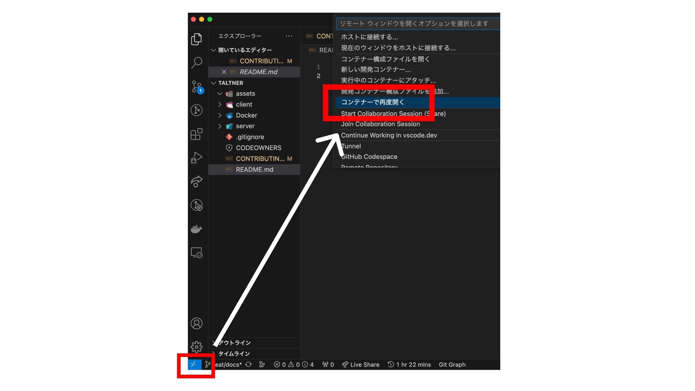
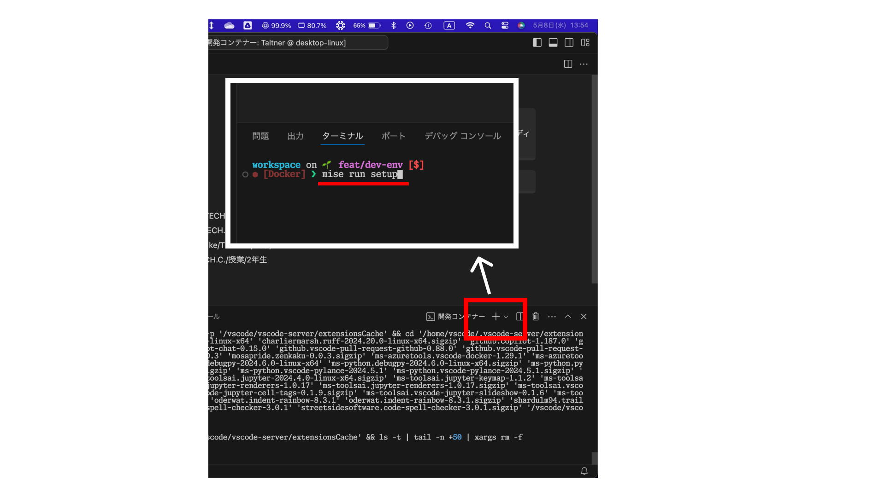
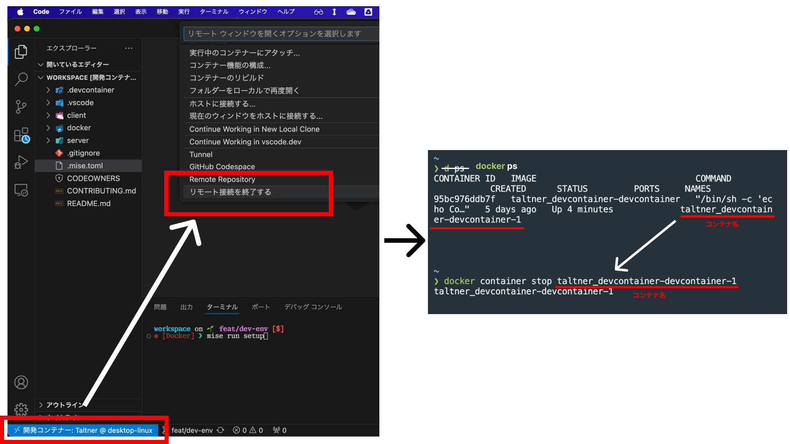

**このガイドラインは現在工事中です。**

# Contributing Guide

## はじめに

このドキュメントは、プロジェクトの開発ガイドラインを提供することを目的としています。<br>
チームメンバー全員が効率的かつ一貫した方法で作業できるよう、以下のポリシーに従ってください。

## 機能の追加やバグの修正

新しい機能の提案やバグの報告は、Issues を通じて行います。新しい Issue は、[Issue Form](工事中)から作成してください。

## ブランチ戦略について

このプロジェクトでは、以下のブランチ戦略を採用しています。

### ブランチの種類

- `main`: デフォルトブランチ。本番環境にデプロイされるコードがマージされます。
- `<機能名>`: 新機能の追加やバグの修正など、機能単位での作業を行うブランチ。<br>
  開発はこのブランチで行います。ブランチ名は`kebab-case`で記述してください。

## Pull Request の作成

新しい機能の追加やバグの修正を行う場合、Pull Request(PR)を作成してください。<br>

### PR の作成手順

1. ブランチを作成し、作業を行います。
2. 作業が完了したら、`main`ブランチに対して PR を作成します。
3. PR のタイトルと本文には、作業内容や変更点、関連する Issue 番号を明確に記述してください。PR のテンプレートはそのうち追加します。
4. レビュワーを指定し、レビューを依頼します。`client/`には @nka21 が、それ以外には @KorRyu3 が自動的にレビュワーに設定されます。

### PR のマージについて

PR の Auto merge 設定は切ってあります。<br>
main へのマージは、最後に承認したレビュワーが責任を持って行ってください。

## コミットの書き方

コミットメッセージは、[Conventional Commits](https://www.conventionalcommits.org/ja/v1.0.0/)の規約に従います。形式は以下の通りです：

```md
<type>(optional <scope>): <description>

[optional <body>]

[optional <footer(s)>]
```

`type`は変更の種類を示し、以下のものを指定する必要があります：

- `feat`: 新しい機能
- `update`: バグ以外の修正
- `fix`: バグの修正
- `docs`: ドキュメント関連
- `ci`: CI/CD 設定
- `refactor`: 仕様に影響がないコード改善（リファクタリング）
- `chore`: ビルド、補助ツール、ライブラリ関連

その他説明:

- `scope`は変更が影響を与える範囲です。（オプション）
- `description`は変更内容を簡潔に説明します。
- `body`は変更内容の詳細を記述します。（オプション）
- `footer`は関連する Issue 番号や、破壊的変更がある場合に記述します。（オプション）

### 例:

```md
feat(login): ユーザーログイン機能を追加

ログイン API を実装し、セキュリティを強化しました。具体的には〜〜

BREAKING CHANGE: 新しい認証フローを導入したため、古い認証メソッドは削除されます。
```

※ コミットを行う際は、commitlint によって形式が自動チェックされます。<br>
フォーマットに従っていないと拒否されるので、注意してください。

<!-- 開発環境について -->

## 開発環境

このプロジェクトでは、`Python 3.10.14`と`Node.js 21.7.3`を使用しています。<br>
また、ランタイムのバージョン管理には`mise`, 言語のパッケージ管理には`Poetry`と`npm`を使用しています。<br>
詳細なバージョン情報は、各ディレクトリの`pyproject.toml`や`package.json`を参照してください。

開発環境はすべて Docker で構築されています。開発には、Docker 上で作業してください。

外部エディタとして VSCode(Cursor)を使用する場合、`Dev Container`拡張機能の使用を推奨します。

下記の開発環境の構築は、VSCode(Cursor)の`Dev Containers`を使用する前提での説明です。<br>
他のエディタを使用する場合は、各自で環境構築を行ってください。

### 開発環境の構築

1. このリポジトリをクローンします。
2. VSCode でクローンしたリポジトリを開きます。
3. 左下の`><`アイコンをクリックし、`Reopen in Container`(コンテナで再度開く)を選択します。



1. コンテナが起動したら、新規ターミナルを開き、`mise`コマンドを使用してセットアップをします。

```bash
# プロジェクト全体のセットアップ
# /workspaceにいることを確認してください
mise run setup

# client/のセットアップ
cd /workspace/client && mise run setup-client-dev

# server/のセットアップ
cd /workspace/server && mise run setup-server-dev
```



5. Git に接続するために、`git config`を設定します。

```bash
# ユーザー名とメールアドレスを設定
# ローカルの設定を引っ張ってくると楽です
git config --global user.name "Your Name"
git config --global user.email "Your Email"

# commitを行う際のエディタを設定(optional)
# VSCodeを使用する場合
git config --global core.editor "code --wait"
```

#### 環境から抜ける

Dev Containers から抜ける場合は、左下の`><`アイコンをクリックし、リモート接続を切断します。

また、ローカルのターミナルで、`docker container stop <コンテナ名>`でコンテナを止めてください。<br>
コンテナ名は、`docker ps`で、現在アクティベートされているコンテナ一覧が見れます。



#### Docker 内の Git での ssh 接続について

Docker 内での`git push`や`pull`の際に、ssh 接続を使用する場合は、「[Visual Studio Code の Remote Containers からも Git を使う方法 - おかしんワークス](https://okash1n.works/posts/how-to-use-git-inside-vscode-dev-container/)」を参考に設定してください。<br>
Docker 外での ssh 接続に比べてやや複雑ですが、毎回パスワードを入力する手間が省けるため、おすすめです。

#### おまけ

今回、Docker 内の Terminal の Prompt を見やすくするために Starship を導入しています。<br>
自分好みな設定に変更したい場合、`~/.config/starship.toml`を編集してください。<br>
Font を変えたりしてもいいかもしれません。

### CI について

最後に、このプロジェクトで使用予定の CI を説明します。<br>
CI は、`git commit`前のフックと、PR 作成時に自動チェックが行われます。

詳細は [#6](https://github.com/dz0o0/Taltner/issues/6) を参照してください。

#### Python

- `Ruff`: リンター・フォーマッター
- `mypy`: 静的型チェッカー

#### Node.js

- `ESLint`: リンター
- `Prettier`: フォーマッター

#### その他

- `commitlint`: コミットメッセージの形式チェック

<!-- README -->

## README について

トップレベルの README.md は、プロジェクトの概要や使い方を記述しています。

また、`client/`, `server/`などのサブディレクトリにはそのディレクトリ内のファイル構成や使い方に関する README.md を配置します。(仮)

<!-- miseのタスク -->

## mise のタスク設定

mise では、`mise run <task name>`で実行できるタスク(コマンド)を設定できます。<br>
コマンドを短縮したり、複数のコマンドをまとめたりすることができます。

現在設定しているタスクは、全て`.mise.toml`に記述されています。<br>
タスクの追加は大歓迎ですが、既存のタスクの変更を行う場合は、事前に`Issue`を立ててください。

### 記述方法:

```toml
# miseで実行するタスクの設定

[tasks.<task name>]  # コマンド名
description = ""  # 説明
run = "<command>"  # 実行したいコマンド
```

### 例:

`mise run hello`コマンドで`echo Hello World`と`touch hello.txt`を実行するタスク

```toml
# mise run hello
[tasks.hello]
description = "Hello World"
run = "echo Hello World && touch hello.txt"
```
